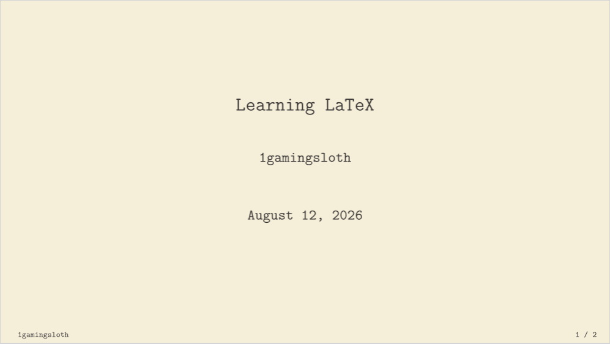
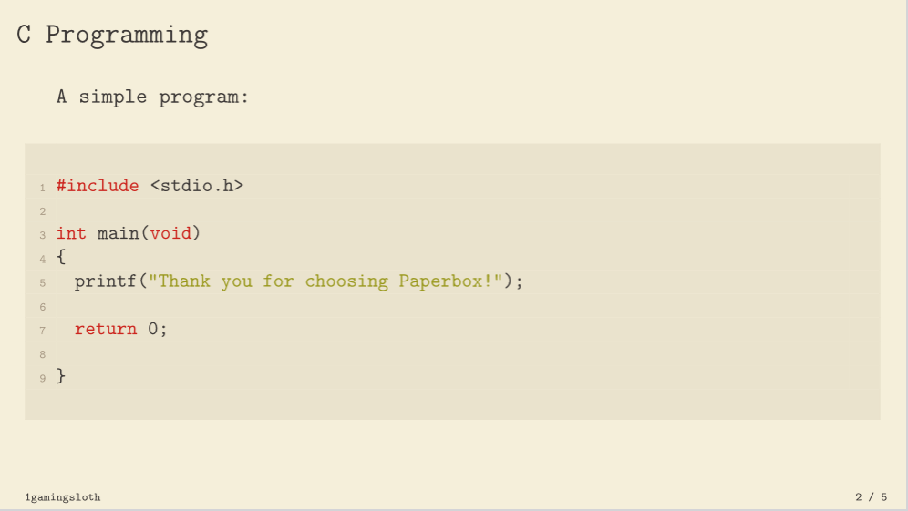
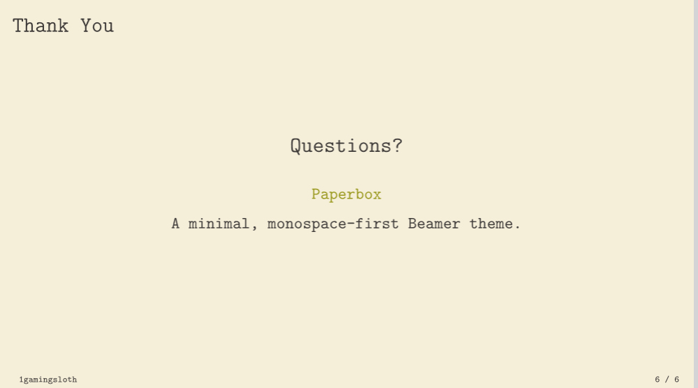

# paperbox
A monospace first beamer theme inspired by Gruvbox

## About
I created paperbox to learn more about LaTeX. Paperbox is meant to be lightweight and simple. 
The lack of features can as such be seen as a feature. 
I really appreciate constructive criticism as this is my first project in LaTeX.

## Images
Here are some images!






## Usage

Add the .sty file to your project and use something like:

```latex
\documentclass[aspectratio=169]{beamer}
\usetheme{Paperbox}

\title{My Presentation}
\author{Your Name}
\date{\today}

\begin{document}

\begin{frame}
    \titlepage
\end{frame}

\begin{frame}{Hello}
    Hello, Paperbox!
\end{frame}

\end{document}
```

## License
This theme is licensed under MIT. Please read [MIT License](./LICENSE).

## Acknowledgements
Paperbox is inspired and based on
[Gruvbox](https://github.com/morhetz/gruvbox). Many of the colours originate from Gruvbox.
